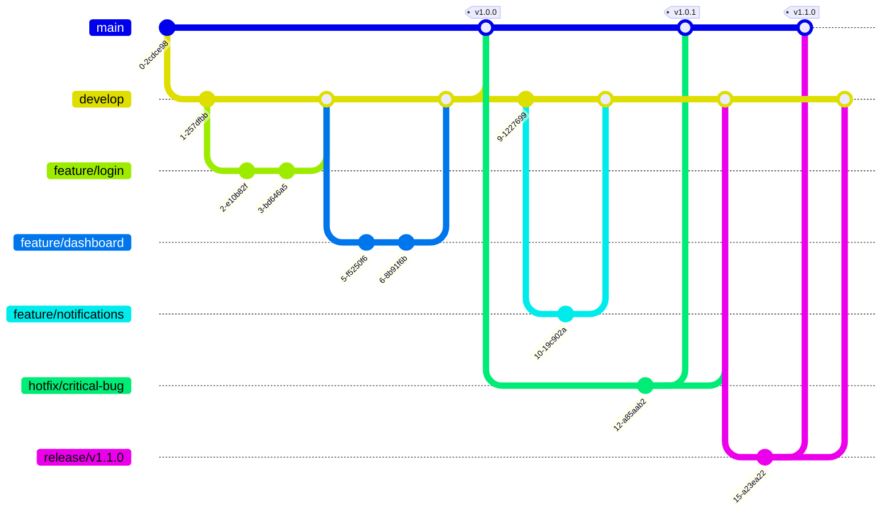

# Next.js Boilerplate

A modern, feature-rich Next.js boilerplate with TypeScript, React Query, Form Validation, and Internationalization support designed for building scalable web applications.


## 🚀 Features

- **Modern Stack**: Built with Next.js 15, React 19, and TypeScript
- **Data Management**: Integrated TanStack React Query for efficient data fetching and caching
- **Form Handling**: Robust form validation with React Hook Form
- **Internationalization**: Multi-language support with next-intl
- **Styling**: MUI for utility-first styling
- **Developer Experience**: Deno, Deno fmt, Husky, and Conventional Commits
- **Type Safety**: Full TypeScript support throughout the codebase
- **Optimized Performance**: Built-in optimizations for production builds

## 📚 Tech Stack

### Core Dependencies

- [Next.js 15](https://nextjs.org/) - The React Framework for the Web
- [React 19](https://reactjs.org/) - A JavaScript library for building user interfaces
- [TypeScript](https://www.typescriptlang.org/) - JavaScript with syntax for types
- [Next.js App Router](https://nextjs.org/docs/app) - New routing system for Next.js

### Data Management & Forms

- [React Hook Form](https://react-hook-form.com/) - Performant, flexible and extensible forms
- [Axios](https://axios-http.com/) - Promise based HTTP client
- [js-cookie](https://github.com/js-cookie/js-cookie) - A simple, lightweight JavaScript API for handling cookies

### UI & Styling

- [MUI](https://mui.com/) - React components for faster and easier web development

### Internationalization

- [next-intl](https://next-intl-docs.vercel.app/) - Internationalization for Next.js

### Development Tools

- [Deno](https://deno.com/) - Pluggable JavaScript linter
- [Deno fmt](https://deno.com/docs/tools/formatter) - Opinionated code formatter
- [Husky](https://typicode.github.io/husky/) - Git hooks made easy

## 🗂️ Project Structure

```
next-boilerplate/
├── .github/              # GitHub workflows and configurations
├── .husky/               # Git hooks configuration
├── .next/                # Next.js build output (generated)
├── .vscode/              # VS Code settings
├── public/               # Static files
├── src/                  # Source code
│   ├── assets/           # Assets
│   ├── components/       # React components
│   ├── hooks/            # Custom React hooks
│   ├── constants/        # Constants
│   ├── lib/              # Utility libraries
│   ├── services/         # API services and endpoints
│   ├── styles/           # Global styles
│   ├── types/            # TypeScript type definitions
│   └── utils/            # Utility functions
├── .env                  # Environment variables
├── .env.local            # Local environment variables (not committed)
├── .gitignore            # Git ignore rules
├── .prettierrc           # Prettier configuration
├── .prettierignore       # Prettier ignore rules
├── commitlint.config.js  # Commit message linting rules
├── eslint.config.js      # ESLint configuration
├── next.config.js        # Next.js configuration
├── package.json          # Project dependencies
├── tailwind.config.js    # Tailwind CSS configuration
└── tsconfig.json         # TypeScript configuration
```

## 🛠️ Setup & Installation

Make sure to install dependencies:

```bash
# npm
npm install

# pnpm
pnpm install

# yarn
yarn install

# bun
bun install
```

## 🚀 Development

### Available Scripts

- `dev`: Start development server
- `build`: Build for production
- `start`: Start production server
- `lint`: Run Deno lint
- `fmt`: Format code with Deno fmt
- `type-check`: Run TypeScript type checking
- `prepare`: Install Husky hooks

## 🚀 Development Server

Start the development server on `http://localhost:3000`:

```bash
# npm
npm run dev

# pnpm
pnpm dev

# yarn
yarn dev

# bun
bun dev
```

## Production

Build the application for production:

```bash
# npm
npm run build

# pnpm
pnpm build

# yarn
yarn build

# bun
bun run build
```

Start the production server:

```bash
# npm
npm run start

# pnpm
pnpm start

# yarn
yarn start

# bun
bun run start
```

## Code Quality

### Naming Conventions

This project follows specific naming conventions to improve code readability:

- Add the `on` prefix before function names when the function handles an event:

  ```typescript
  // Good
  const onChangeDraggable = (event) => {
    /* ... */
  }
  const onSubmit = (data) => {
    /* ... */
  }

  // Avoid
  const changeDraggable = (event) => {
    /* ... */
  }
  const submit = (data) => {
    /* ... */
  }
  ```

- Add the `is` prefix before variable names when the return value is boolean:

  ```typescript
  // Good
  const isHiddenButton = status === 'completed'
  const isLoading = query.isLoading

  // Avoid
  const hiddenButton = status === 'completed'
  const loading = query.isLoading
  ```

### Linting

This project uses ESLint and Prettier for code quality:

```bash
# Run linting
npm run lint

# Fix linting issues
npm run lint:fix

# Format code
npm run format
```

### Commit Guidelines

This project uses conventional commits with the following commit types:

- `feature`: A new feature
- `fix`: A bug fix
- `docs`: Documentation only changes
- `style`: Changes that do not affect the meaning of the code
- `refactor`: A code change that neither fixes a bug nor adds a feature
- `perf`: A code change that improves performance
- `test`: Adding missing tests or correcting existing tests
- `build`: Changes that affect the build system or external dependencies
- `ci`: Changes to our CI configuration files and scripts
- `chore`: Other changes that don't modify src or test files
- `revert`: Reverts a previous commit
- `translation`: Translation related changes
- `security`: Security related changes

Commit message format:

```
type(scope): subject

[optional body]

[optional footer]
```

Example:

```
feat(auth): add login functionality

- Add login form component
- Implement authentication service
- Add error handling

Closes #123
```

## Git Flow

This project follows a simplified Git flow workflow to maintain code quality and streamline the development process.



### Branches

- **main**: Production code. Only merged from release branches or hotfixes.
- **develop**: Integration branch where features are combined and tested.
- **feature/\***: Individual feature branches created from develop.
- **hotfix/\***: Emergency fixes for production issues, branched from main.
- **release/\***: Preparation for a new production release, branched from develop.

### Workflow

1. **Feature Development**

   - Create a feature branch from develop: `git checkout -b feature/new-feature develop`
   - Develop the feature with regular commits
   - When complete, create a PR to merge back into develop

2. **Release Preparation**

   - Create a release branch when develop is ready for release: `git checkout -b release/v1.0.0 develop`
   - Make only bug fixes and documentation updates in this branch
   - When ready, merge to both main and develop:
     ```
     git checkout main
     git merge --no-ff release/v1.0.0
     git tag -a v1.0.0
     git checkout develop
     git merge --no-ff release/v1.0.0
     ```

3. **Hotfixes**
   - For critical production bugs, create a hotfix branch from main: `git checkout -b hotfix/critical-bug main`
   - Fix the issue
   - Merge back to both main and develop:
     ```
     git checkout main
     git merge --no-ff hotfix/critical-bug
     git tag -a v1.0.1
     git checkout develop
     git merge --no-ff hotfix/critical-bug
     ```

This workflow helps maintain a clean repository history and provides a structured approach to development, testing, and releases.

## Deployment

The easiest way to deploy your Next.js app is to use the [Vercel Platform](https://vercel.com/new?utm_medium=default-template&filter=next.js&utm_source=create-next-app&utm_campaign=create-next-app-readme) from the creators of Next.js.

Check out the [Next.js deployment documentation](https://nextjs.org/docs/app/building-your-application/deploying) for more details.
